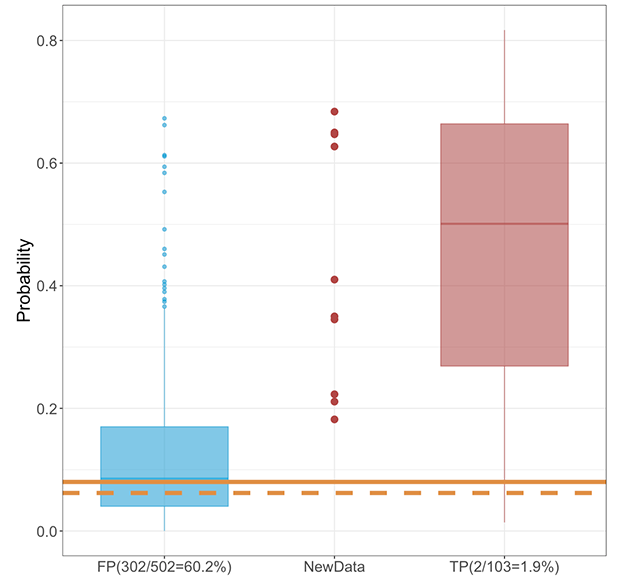
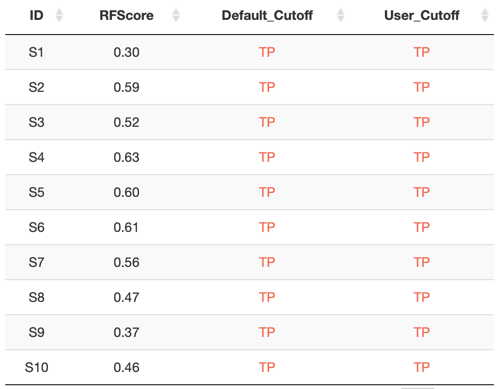

# Results {#results}

The results of the tool are shown in the right of the page: a boxplot on the top and a table on the bottom. 

The boxplot (Figure \@ref(fig:fig-boxplot)) shows the distribution of the probability (fraction of *votes*) for each sample calculated from LOOCV in false and true positive groups. The estimation of the probability for the input samples is shown in the center of the boxplot. Users have to choose a cutoff for the probability to decide true positives. In order to help users to make the decision, we have a suggested cutoff as the default in the online tool. 


```{r fig-boxplot, echo=FALSE, fig.cap="Boxplot in results", out.width="50%", fig.align="center"}

```

The table (Figure \@ref(fig:fig-table)) includes 4 columns: sample id, probability (fraction of *votes*), result from suggested (default) cutoof, and result from user selected cutoff.

```{r fig-table, echo=FALSE, fig.cap="Table in results", out.width="50%", fig.align="center"}

```