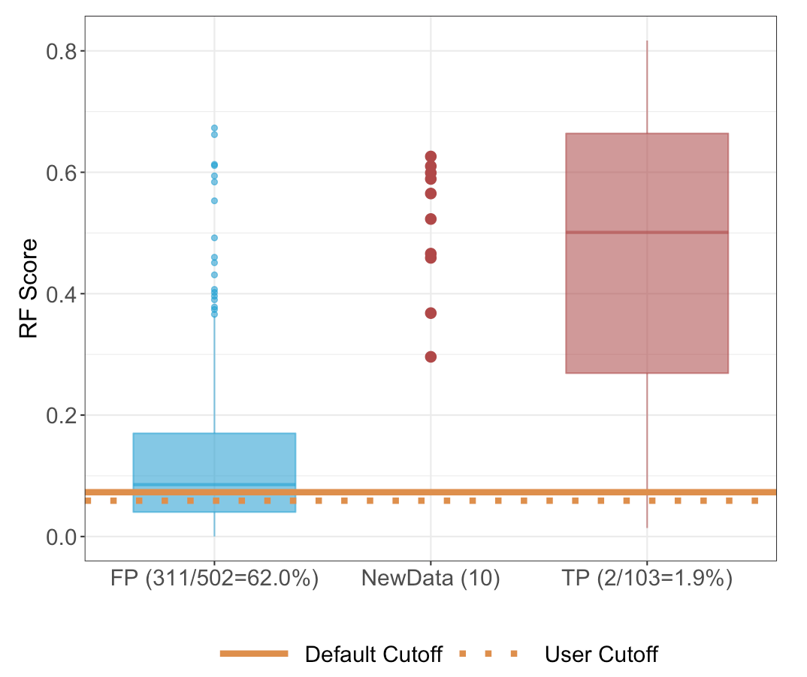

# Results {#results}

The results of the tool are shown in the right of the page: a boxplot on the top and a table on the bottom. 

The boxplot (Figure \@ref(fig:fig-boxplot)) shows the distribution of the *__RF score__* for each sample calculated from LOOCV in false and true positive groups. The *__RF score__* for the input samples is shown in the center of the boxplot. Users need to choose a cutoff of sensitivity that correlates with *__RF score__* directly. In order to help users to make the decision, we have a suggested cutoff as the default in the online tool. The suggested cutoff is described in Section \@ref(methods). Users can also choose the cutoff according to their data. The suggested cutoff is shown as solid line while the cutoff chosen by the users are shown in dash line. When users change the cutoff of sensitivity, an estimation of specificity is shown under the slider.

There are numbers at the bottom of the boxplot. In Figure \@ref(fig:fig-boxplot), the number for the false positive is "311/502=62.0%" and the number for the true positive is "2/103 = 1.9%", which indicates that 302 (62.0%) out of 502 false positives in the training data will remain as false positive while 2 (1.9%) out of 103 true positive will be categorized as false negative with user selected cutoff. In other words, we could remove 192 (38%) false positives and 2 false negatives (there are 4 false negatives with state criteria) from the dataset. Random forest removes false positives without introducing false negatives; in other words, it can yield second-tier NBS test results with higher specificity without reducing sensitivity. 


```{r fig-boxplot, echo=FALSE, fig.cap="Boxplot in results", out.width="50%", fig.align="center"}

```

The table (Figure \@ref(fig:fig-table)) includes 4 columns: sample id, *__RF score__*, results from suggested (default) cutoff, and results from user selected cutoff.

```{r fig-table, echo=FALSE, fig.cap="Table in results", out.width="50%", fig.align="center"}
knitr::include_graphics("image/table.png")
```

