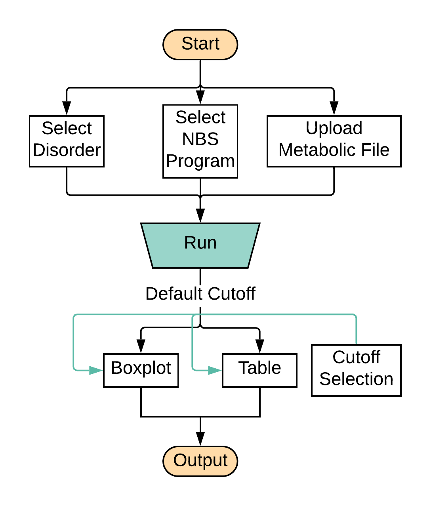

--- 
title: "User Guide for RUSP_RF"
author: "Gang Peng"
date: "`r Sys.Date()`"
site: bookdown::bookdown_site
documentclass: book
classoption: openany
bibliography: [book.bib]
biblio-style: apalike
link-citations: yes
description: "A detailed user guide on how to use the online tool RSUP_RF"
---

# Preface{-}
This is a detailed user guide on how to use the online tool RSUP_RF.

## General Illustration{-}

Figure \@ref(fig:fig-userguide) shows the general process to run the tool. Users select the disorder type, where the data come from (State), and then upload the input file to the online tool. The detailed description about input data file format can be found at Section \@ref(dataformat). After clicking the **Run RUSP_RF** button, there will be a figure and a tale shown on the right of the page. Users can check the details of the result at Section \@ref(results).

```{r fig-userguide, echo=FALSE, fig.cap="How to run the tool", out.width="50%", fig.align="center"}

```


